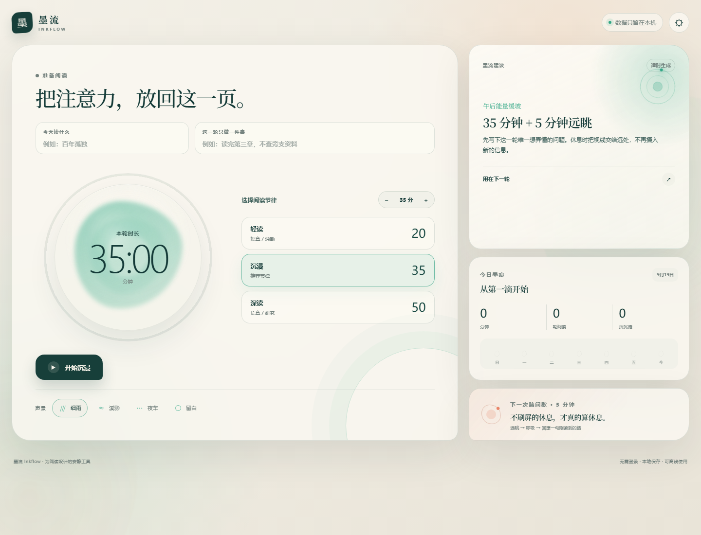

# 墨流 Inkflow

> 为深度阅读留一片安静。



墨流是一款为长时间阅读设计的本地优先专注工具。它把一轮阅读拆成“准备阅读 → 安静专注 → 脑间歇 → 留下阅读痕迹”，用轻量计时、环境声和节律建议帮助你持续读下去，而不是把注意力变成另一张任务清单。

## 现在可以做什么

- 输入书名、章节或本轮阅读意图，选择阅读时长。
- 在专注和脑间歇之间切换，支持暂停、继续和提前结束。
- 自定义阅读时长、脑间歇时长和阅读目标。
- 使用雨声、溪流、夜色或静音等声景；音量和主题可以在设置中调整。
- 结束一轮后记录阅读分钟数、轮数和大致页数，查看最近七天的阅读形状。
- 根据当天的阅读量和时间给出轻量建议，不强迫打卡。
- 书名、阅读记录和偏好保存在当前设备浏览器中；无需登录，也可以离线使用。

## 60 秒演示

1. 打开应用，输入正在读的书名和这一轮想完成的章节。
2. 选择 25、45、60 分钟或自定义时长，点击开始阅读。
3. 专注中可以暂停或继续；打开“声景”时，环境声只做背景，不打断阅读。
4. 完成后选择进入脑间歇，按提示远眺、呼吸，再回想刚读到的一句话。
5. 填写本轮大约读了多少页，保存这条阅读痕迹。
6. 回到首页查看今天累计分钟数、完成轮数和最近七天的阅读趋势。

## 预览与本地运行

当前仓库还没有公开在线演示地址。可以在本地运行真实应用：

```bash
npm install
npm run dev
```

然后打开终端显示的本地地址。生产构建和检查：

```bash
npm run build
npm test
```

项目包含一张当前界面预览图：[public/og.png](public/og.png)。

## 数据与隐私

- 不需要账号，不上传书名、阅读记录或偏好。
- 数据使用浏览器本地存储，换设备或清除浏览器数据后不会自动同步。
- 环境声由浏览器本地生成，不依赖第三方音频服务。
- 应用的目标是减少打扰；它不会把阅读过程变成连续通知。

## 技术结构

- React 19 + TypeScript
- Next/Vinext 运行时与 Vite 构建链路
- 本地浏览器存储保存设置和阅读记录
- Web Audio API 生成环境声
- `tests/rendered-html.test.mjs` 做构建后的页面检查

## 项目状态

当前版本是一个可以使用的专注阅读原型。下一步适合补充公开预览地址、首屏截图、键盘操作说明和更完整的测试说明，再考虑跨设备同步。

## 项目链接

- 仓库：[daizhetang-create/inkflow--](https://github.com/daizhetang-create/inkflow--)
- 项目名：墨流 Inkflow
- 产品方向：深度阅读、低打扰专注、本地优先
